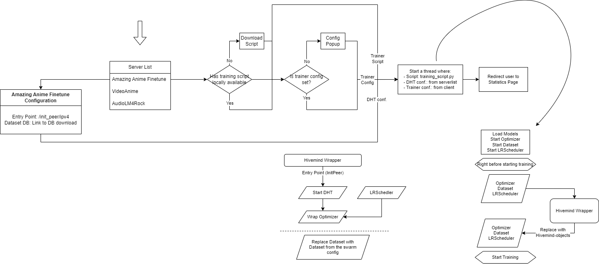

Proposed Workflow:

# Current work:
Right now we will focus on the serverlist server, just to have a foundation on what to build for.

I've added some code (by chatgpt lol) to store the swarms server list entries.
Here is the format:

- Swarm ID: A unique identifier for each swarm.
- Number of Peers: The number of peers currently connected to the swarm.
- Resources: Information about the resources available in the swarm, such as CPU, memory, and storage.
- Trainer Script: The specific trainer script to be used for this swarm.
- Swarm Configuration: The configuration for swarm peers, that will be used to communicate with eachother and obtain the dataset.
- Trainer Configuration: The configuration for the trainer script, such as the version, framework, dataset, and any other relevant settings.
- Status: The status of the swarm, whether it is active or inactive.

Each entry will be managed by the user who created said entry.